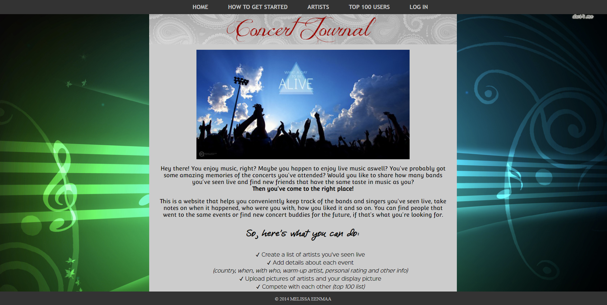
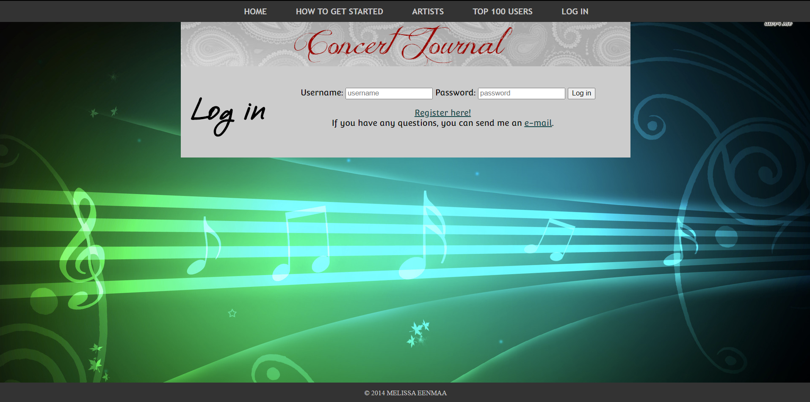
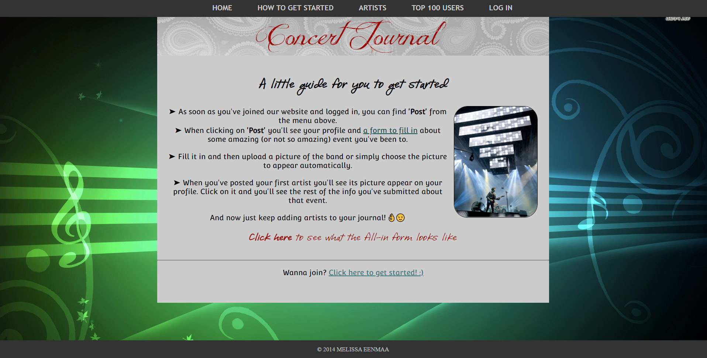
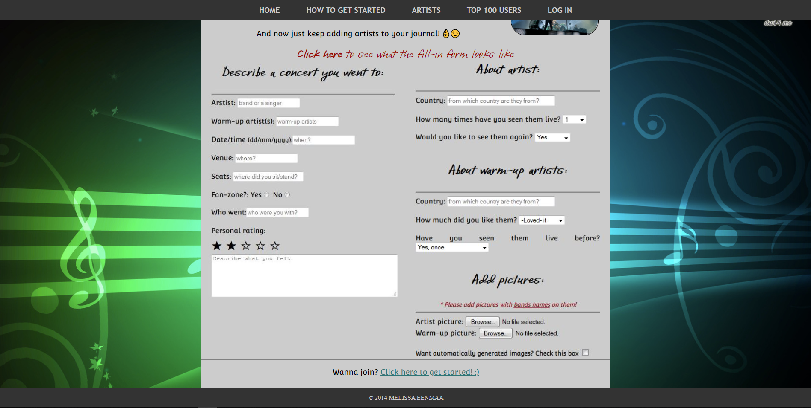
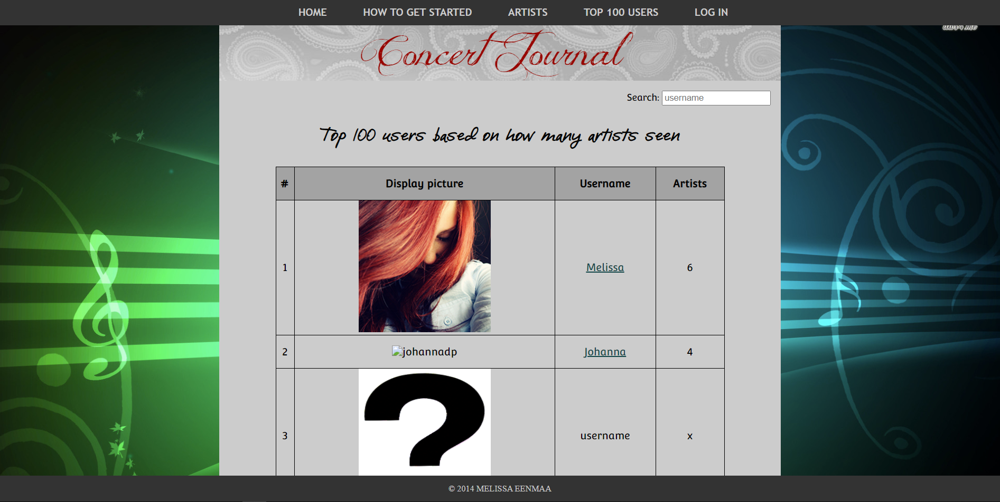
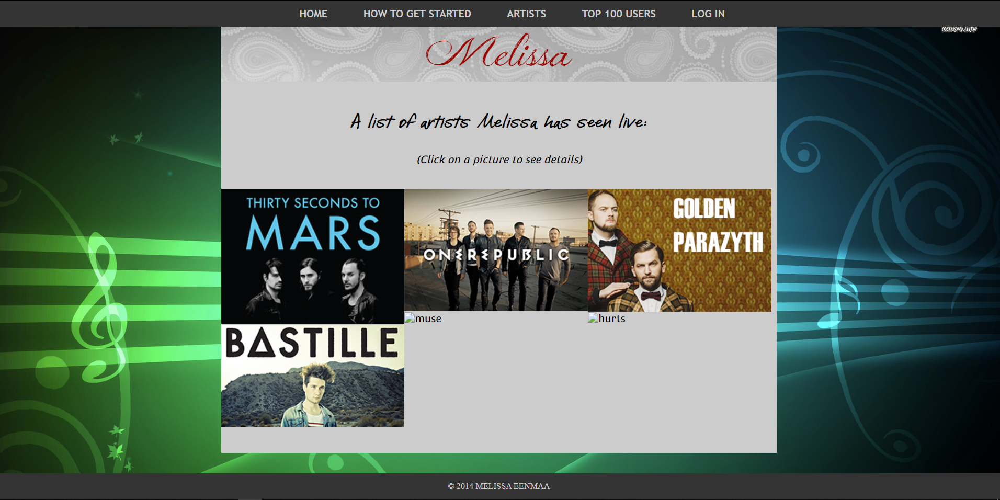
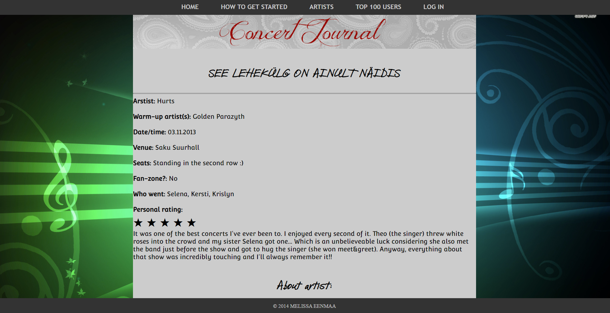
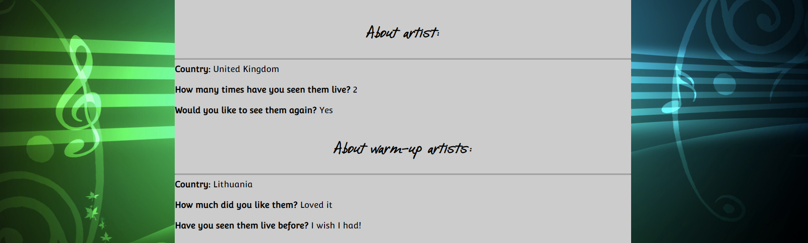

  <h1><code>Concert Journal</code></h1>
  
   <strong>A social media platform dedicated to sharing and keeping track of concert experiences</strong>

## 📚 About

* Proof of Concept (POC) website
* Created in IT College first year as a personal project during the first front-end subject. Got grade 5 (A).
* Done using minimal and plain HTML, JS and CSS
* Design has this nostalgic 90s feel, actual website would need modernization :stuck_out_tongue:

## :camera: Screenshots

### General 

### Personal

